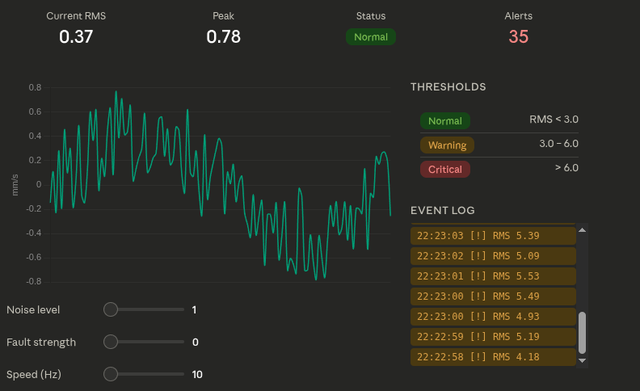
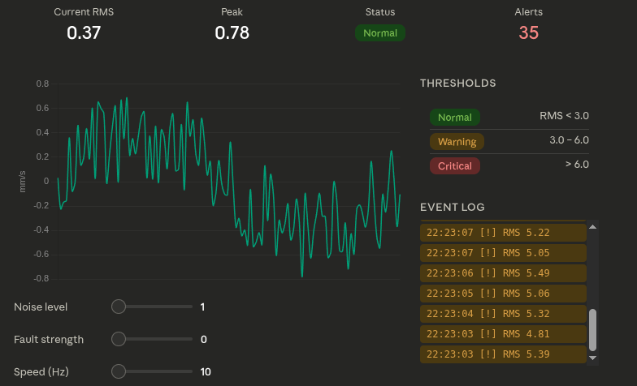
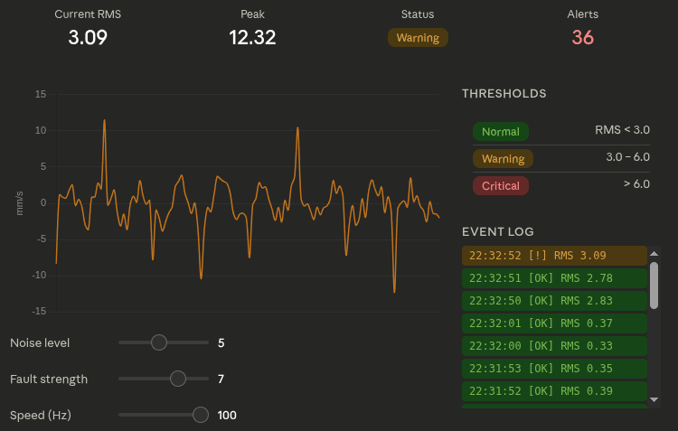

# 🔧 Machine Health Monitoring System

A lightweight Python-based system designed to simulate and analyze machine vibration data for basic condition monitoring.

---

## 🚀 Overview
This project demonstrates how real-time sensor data can be used to monitor machine health and detect abnormal behavior.

The system:
- Simulates vibration-like time-series data  
- Visualizes data using graphs  
- Detects anomalies using threshold-based logic  
- Classifies machine condition into:
  - ✅ Normal  
  - ⚠️ Warning  
  - ❌ Critical  

---

## 📊 Features
- Real-time data simulation  
- Time-series visualization using Matplotlib  
- Simple anomaly detection logic  
- Condition classification system  

---

## 🛠️ Tech Stack
- Python  
- Matplotlib  

---

## 📈 Output Example
Graph showing vibration behavior over time with condition classification.

---

## 🧠 Concept
This project is a basic prototype of industrial condition monitoring systems used in:
- Predictive maintenance  
- Fault detection  
- Equipment health monitoring  

---

## 🔮 Future Improvements
- Integration with real sensors (accelerometers)  
- Advanced anomaly detection (ML models)  
- Real-time dashboard (Streamlit)  

---

## 👨‍💻 Author
Mayank Bansal